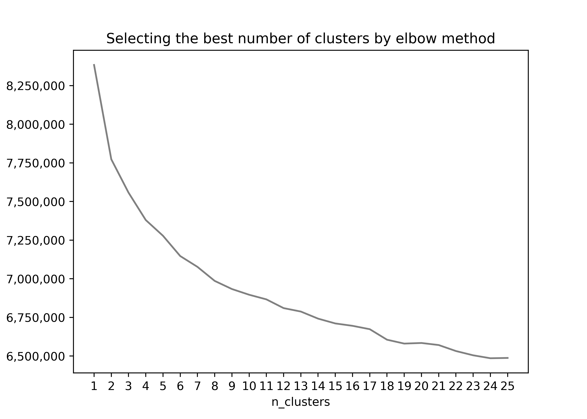

# Capstone Project: Create a Customer Segmentation Report for Arvato Financial Services

### About the project

This repository is for the final project of Udacity's Data Science Nanodegree program.  

There are 2 main goals in the project:  
using machine learning algorithms and datasets provided by Arvato, a mail-order sales company in Germany, 
* the characteristics of the company's customers compared to general republic should be clarified  
* a forecasting model to predict customers' response for a marketing campaign needs to be developed

### Part 0 - Data understanding and pre-processing

There are 5 datasets given:
* 3 dataset files
  - azdias: demographic data for the general population of Germany; 891 211 persons x 366 features  
  - customers: demographic data for customers of the company; 191 652 persons x 369 features  
  - mailout : demographic data for individuals targets of a marketing campaign; 42 982 persons x 367 features
* 2 reference files  
  - ref_info (DIAS Information Levels): a top-level list of attributes and descriptions in Excel.
    This file is to explain dataset features in unreadable German acronyms.  
  - ref_attr (DIAS Attribute): a detailed mapping of data values for each feature in alphabetical order in Excel.  
    This file is to clarify the meanings of dataset Scores in numbers and acronyms.

As the datasets do not have information on what column features and values exactly mean,  
3 steps were taken before finalizing pre-processing:
* step1: Baseline-understanding 
  - feature alignment among dataset and reference files was checked and improved  
  - 2 reference files were upgraded and cleaned to be used in the following sections
  - by analyzing ref_info, overall structure of datasets were studied
  - by analyzing ref_attr, contents of datasets were checked.
    At this stage the baseline of pre-processing items were made including data catagories (discrete or continuous) by feature, values to be replaced as null, etc.
* step2: Dataset exploration 
  - based on framework findings from step1, step2 analyzed actual datasets and refined findings.  
  - data catagories of features were adjusted, each continuous feature was deep-dived for possible pre-processing and the outlines of pre-processing in step1 were checked in detail.
* section3: Pre-processing
  - pre_processing items noted in step 1 and 2 were used
  - after pre-processing columns and rows with excessive missing values were removed 

| index                            | method      | by_feature                                                         |
|:---------------------------------|:------------|:-------------------------------------------------------------------|
| 3.1.2-dtype                      | astype      | All features in numeric_discrete_features / change dtype to float  |
| 3.2.2-EINGEFUEGT_AM              | astype      | EINGEFUEGT_AM / change dtype to datetime only with year values     |
| 2.3.1-drop                       | drop        | All / drop features in to_drop                                     |
| 3.1.1-ANZ_HAUSHALTE_AKTIV        | log_scaling | ANZ_HAUSHALTE_AKTIV                                                |
| 3.1.1-KBA13_ANZAHL_PKW           | log_scaling | KBA13_ANZAHL_PKW                                                   |
| 3.2.1-ANZ_STATISTISCHE_HAUSHALTE | log_scaling | ANZ_STATISTISCHE_HAUSHALTE                                         |
| 2.3.1-to_null                    | mask        | All / replace Score to null if corresponding Meaning is in to_null |
| 2.3.1-unknown_9                  | mask        | category_small in unknown_9 / Score 9 to -1                        |
| 3.1.1-ANZ_PERSONEN               | np.where    | ANZ_PERSONEN / Score > 10 to -1                                    |
| 3.1.1-ANZ_TITEL                  | np.where    | ANZ_TITEL / Score of ANZ_PERSONEN > 10 to -1                       |
| 3.1.1-GEBURTSJAHR                | np.where    | GEBURTSJAHR / Score < 1900 to -1                                   |
| 3.2.1-EINGEZOGENAM_HH_JAHR       | np.where    | EINGEZOGENAM_HH_JAHR / Score < 1980 to -1                          |
| 2.3.1-minus1                     | replace     | All / {-1: np.nan}                                                 |
| 3.1.1-LP_FAMILIE_FEIN            | replace     | LP_FAMILIE_FEIN / {0: -1}                                          |
| 3.1.1-LP_FAMILIE_GROB            | replace     | LP_FAMILIE_GROB / {0: -1}                                          |
| 3.1.1-LP_LEBENSPHASE_FEIN        | replace     | LP_LEBENSPHASE_FEIN / {0: -1}                                      |
| 3.1.1-LP_LEBENSPHASE_GROB        | replace     | LP_LEBENSPHASE_GROB / {0: -1}                                      |
| 3.1.2-CAMEO_DEUG_2015X           | replace     | CAMEO_DEUG_2015 / {"X": -1}                                        |
| 3.1.2-CAMEO_DEU_2015             | replace     | CAMEO_DEU_2015 / {"XX": -1}                                        |
| 3.1.2-CAMEO_INTL_2015XX          | replace     | CAMEO_INTL_2015 / {"XX": -1}                                       |

### Part 1 - Customer Segmentation Report

<!--  -->

<!--  -->

this section focuses on the reference files that can help in understanding dataset contents.

This section aims to understand outlines of the 2 datasets and identify baseline factors.  

* libraries used, the motivation for the project, the files in the repository with a small description of each
* a summary of the results of the analysis, and necessary acknowledgements
* the Project Definition, Analysis, and Conclusion

pip install googletrans==4.0.0-rc1
pip install missingno
pip install pyarrow
custom modules for convenience are in root folder

| Attribute                   |   importance_pct | Description                                                                 | cluster_0                                          | cluster_1                                        | cluster_2                                        | cluster_3                                        | cluster_4                                        | cluster_5                                        | cluster_6                                        | cluster_7                                          | cluster_8                                        |
|:----------------------------|-----------------:|:----------------------------------------------------------------------------|:---------------------------------------------------|:-------------------------------------------------|:-------------------------------------------------|:-------------------------------------------------|:-------------------------------------------------|:-------------------------------------------------|:-------------------------------------------------|:---------------------------------------------------|:-------------------------------------------------|
| D19_GESAMT_ANZ_24           |             12.2 | transaction activity TOTAL POOL in the last 24 months                       | increased activity                                 | no transactions known                            | no transactions known                            | no transactions known                            | no transactions known                            | no transactions known                            | no transactions known                            | increased activity                                 | no transactions known                            |
| LP_STATUS_FEIN              |             12.1 | social status fine                                                          | top earners                                        | houseowners                                      | orientationseeking low-income earners            | top earners                                      | typical low-income earners                       | typical low-income earners                       | typical low-income earners                       | typical low-income earners                         | houseowners                                      |
| CJT_TYP_2                   |             11.6 | nan                                                                         | nan                                                | nan                                              | nan                                              | nan                                              | nan                                              | nan                                              | nan                                              | nan                                                | nan                                              |
| KBA13_ANTG1                 |             10.8 | nan                                                                         | nan                                                | nan                                              | nan                                              | nan                                              | nan                                              | nan                                              | nan                                              | nan                                                | nan                                              |
| OST_WEST_KZ                 |              9.3 | flag indicating the former GDR/FRG                                          | West (FRG)                                         | East (GDR)                                       | West (FRG)                                       | West (FRG)                                       | West (FRG)                                       | East (GDR)                                       | West (FRG)                                       | West (FRG)                                         | West (FRG)                                       |
| KBA13_SITZE_4               |              5.7 | number of cars with less than 5 seats in the PLZ8                           | average                                            | low                                              | average                                          | very high                                        | average                                          | low                                              | average                                          | average                                            | average                                          |
| FINANZ_SPARER               |              4.5 | financial typology: money saver                                             | high                                               | very high                                        | very low                                         | very high                                        | very low                                         | very high                                        | very high                                        | very low                                           | very high                                        |
| KBA13_HERST_BMW_BENZ        |              4.1 | share of BMW & Mercedes Benz within the PLZ8                                | average                                            | low                                              | average                                          | very high                                        | average                                          | low                                              | average                                          | average                                            | average                                          |
| KBA13_ANTG3                 |              2.2 | nan                                                                         | nan                                                | nan                                              | nan                                              | nan                                              | nan                                              | nan                                              | nan                                              | nan                                                | nan                                              |
| D19_GESAMT_DATUM            |              1.9 | actuality of the last transaction with the complete file TOTAL              | highest activity within the last 12 months         | no transactions known                            | no transactions known                            | no transactions known                            | no transactions known                            | no transactions known                            | no transactions known                            | highest activity within the last 12 months         | no transactions known                            |
| KBA13_ALTERHALTER_45        |              1.6 | share of car owners between 31 and 45 within the PLZ8                       | average                                            | average                                          | average                                          | average                                          | very high                                        | very low                                         | average                                          | average                                            | average                                          |
| D19_GESAMT_ONLINE_QUOTE_12  |              1.6 | amount of online transactions within all transactions in the complete file  | 100% Online-transactions within the last 12 months | no Online-transactions within the last 12 months | no Online-transactions within the last 12 months | no Online-transactions within the last 12 months | no Online-transactions within the last 12 months | no Online-transactions within the last 12 months | no Online-transactions within the last 12 months | 100% Online-transactions within the last 12 months | no Online-transactions within the last 12 months |
| KBA13_SEG_OBEREMITTELKLASSE |              1.4 | share of upper middle class cars and upper class cars (BMW5er, BMW7er etc.) | average                                            | low                                              | average                                          | very high                                        | average                                          | low                                              | average                                          | average                                            | average                                          |
| KBA13_SEG_SPORTWAGEN        |              1.3 | share of sportscars within the PLZ8                                         | average                                            | very low                                         | average                                          | very high                                        | average                                          | very low                                         | average                                          | average                                            | average                                          |
| EWDICHTE                    |              1.2 | density of inhabitants per square kilometer                                 | 34 - 89 HH/km²                                     | less than 34 HH/km²                              | 34 - 89 HH/km²                                   | 320 - 999 HH/km²                                 | more than 999 HH/²                               | more than 999 HH/²                               | more than 999 HH/²                               | more than 999 HH/²                                 | 34 - 89 HH/km²                                   |
| KBA13_BAUMAX                |              1.2 | nan                                                                         | nan                                                | nan                                              | nan                                              | nan                                              | nan                                              | nan                                              | nan                                              | nan                                                | nan                                              |
| CAMEO_DEUG_2015             |              1.2 | CAMEO classification 2015 - Uppergroup                                      | consumption-oriented middleclass                   | established middleclasse                         | consumption-oriented middleclass                 | upper class                                      | urban working class                              | working class                                    | working class                                    | working class                                      | consumption-oriented middleclass                 |

### Datasets

* Udacity_AZDIAS_052018.csv:  
  Demographics data for the general population of Germany; 891 211 persons (rows) x 366 features (columns)
* Udacity_CUSTOMERS_052018.csv:  
  Demographics data for customers of a mail-order company; 191 652 persons (rows) x 369 features (columns)
* Udacity_MAILOUT_052018_TRAIN.csv:  
  Demographics data for individuals who were targets of a marketing campaign; 42 982 persons (rows) x 367 (columns)
* DIAS Information Levels: a top-level list of attributes and descriptions in Excel
* DIAS Attribute: a detailed mapping of data values for each feature in alphabetical order in Excel